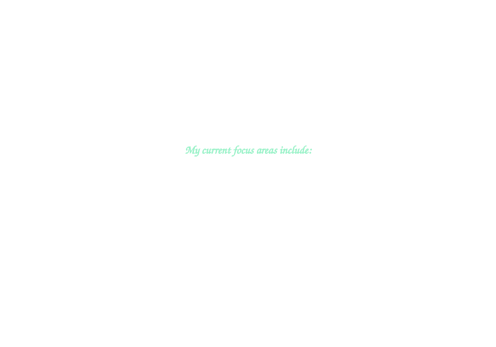

<link rel="preconnect" href="https://fonts.googleapis.com">
<link rel="preconnect" href="https://fonts.gstatic.com" crossorigin>
<link href="https://fonts.googleapis.com/css2?family=Yuyu&display=swap" rel="stylesheet">

  

 

 

&nbsp;
&nbsp;
&nbsp;
&nbsp;
&nbsp;
 
&nbsp;
&nbsp;
&nbsp;
&nbsp;
&nbsp;
&nbsp;
 

 
 

