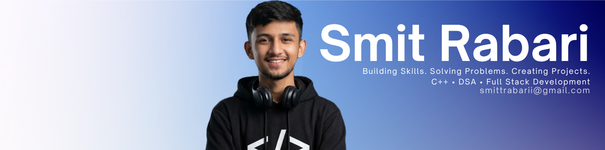
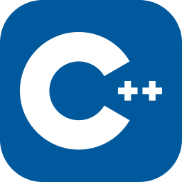
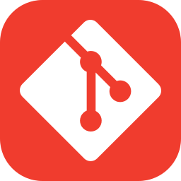

<!-- ==================== MAIN BANNER ==================== -->

<!-- ==================== ABOUT ME ==================== -->

  

 

<!-- ==================== SOCIALS ==================== -->

 

<!-- ==================== TECH STACK ==================== -->

&nbsp;
&nbsp;
&nbsp;
&nbsp;
&nbsp;
 
&nbsp;
&nbsp;
&nbsp;
&nbsp;
&nbsp;
&nbsp;
 

<!-- ==================== PROFILE VIEWS ==================== -->

 

